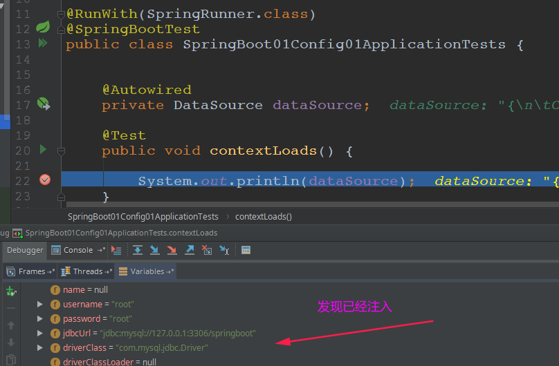
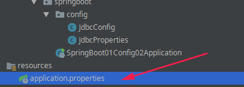
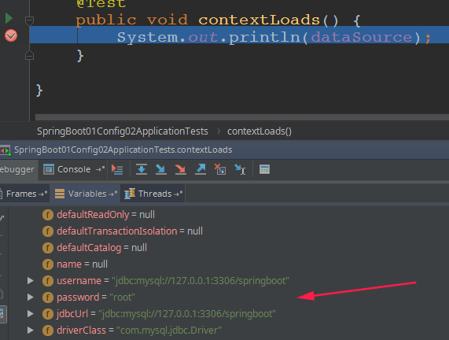
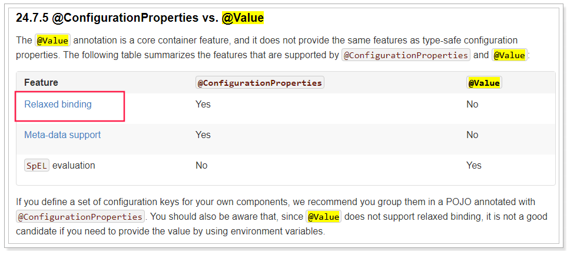

# SpringBootDemoNotes


## 一、属性注入配置简化

### 1、比较繁杂的JavaConfig配置

> 项目: `springboot-01-config-01`

java配置主要靠java类和一些注解，比较常用的注解有：

- `@Configuration`：声明一个类作为配置类，代替xml文件；
- `@Bean`：声明在方法上，将方法的返回值加入Bean容器，代替`<bean>`标签；
- `@value`：属性注入；
- `@PropertySource`：指定外部属性文件；

我们接下来用java配置来尝试实现连接池配置：

首先引入Druid连接池依赖：

```xml
<dependency>
    <groupId>com.alibaba</groupId>
    <artifactId>druid</artifactId>
    <version>1.1.6</version>
</dependency>
```

创建一个`jdbc.properties`文件，编写jdbc属性：

```properties
jdbc.driverClassName=com.mysql.jdbc.Driver
jdbc.url=jdbc:mysql://127.0.0.1:3306/springboot
jdbc.username=root
jdbc.password=root
```
然后编写代码：

```java
@Configuration
@PropertySource("classpath:jdbc.properties")//属性文件位置
public class JdbcConfig {

    //从属性文件 jdbc.properties中注入
    @Value("${jdbc.url}")
    String url;
    @Value("${jdbc.driverClassName}")
    String driverClassName;
    @Value("${jdbc.username}")
    String username;
    @Value("${jdbc.password}")
    String password;

    @Bean // 加入到容器中
    public DataSource dataSource(){
        DruidDataSource dataSource = new DruidDataSource();
        dataSource.setDriverClassName(driverClassName);
        dataSource.setUrl(url);
        dataSource.setUsername(username);
        dataSource.setPassword(password);
        return dataSource;
    }
}

```

解读：

- `@Configuration`：声明我们`JdbcConfig`是一个配置类；
- `@PropertySource`：指定属性文件的路径是:`classpath:jdbc.properties`；
- 通过`@Value`为属性注入值；
- 通过@Bean将 `dataSource()`方法声明为一个注册Bean的方法，Spring会自动调用该方法，将方法的返回值加入Spring容器中；

然后我们就可以在任意位置通过`@Autowired`注入DataSource了！

测试：

```java
@RunWith(SpringRunner.class)
@SpringBootTest
public class SpringBoot01Config01ApplicationTests {


	@Autowired
	private DataSource dataSource;

	@Test
	public void contextLoads() {

		System.out.println(dataSource);
	}

}

```

然后Debug运行并查看：



属性注入成功了！

### 2、优化注入方式一

在上面的案例中，我们实验了java配置方式。不过属性注入使用的是`@Value`注解。这种方式虽然可行，但是不够强大，**因为它只能注入基本类型值**。

在SpringBoot中，提供了一种新的属性注入方式，支持各种java基本数据类型及复杂类型的注入。

1）我们新建一个类，用来进行属性注入：

```java
@ConfigurationProperties(prefix = "jdbc")// 注意加一个前缀
public class JdbcProperties {
    private String url;
    private String driverClassName;
    private String username;
    private String password;
    // ... 略
    // getters 和 setters
}

```

- 在类上通过`@ConfigurationProperties`注解声明当前类为**属性读取类**；

- `prefix="jdbc"`读取属性文件中，前缀为jdbc的值；

- 在类上定义各个属性，名称必须与属性文件中`jdbc.`后面部分一致；

- 需要注意的是，这里我们并没有指定属性文件的地址，所以我们需要把`jdbc.properties`名称改为`application.properties`，这是SpringBoot默认读取的属性文件名：

   

2）在JdbcConfig中使用这个属性：

```java
@Configuration
//@PropertySource("classpath:jdbc.properties")  //这里不需要了
@EnableConfigurationProperties(JdbcProperties.class)  // 使用某个配置属性 (这里使用我们的属性JdbcProperties)
public class JdbcConfig {

    @Bean // Spring会调用这个, 因为注解EnableConfigurationProperties会应用那个属性
    public DataSource dataSource(JdbcProperties prop){
        DruidDataSource dataSource = new DruidDataSource();
        dataSource.setDriverClassName(prop.getDriverClassName());
        dataSource.setUrl(prop.getUrl());
        dataSource.setUsername(prop.getUrl());
        dataSource.setPassword(prop.getPassword());
        return dataSource;
    }
}

```

- 通过`@EnableConfigurationProperties(JdbcProperties.class)`来声明要使用`JdbcProperties`这个类的对象；

- 然后你可以通过以下方式注入`JdbcProperties`：

  - @Autowired注入

    ```java
    @Autowired
    private JdbcProperties prop;
    ```

  - 构造函数注入

    ```java
    private JdbcProperties prop;
    public JdbcConfig(Jdbcproperties prop){
        this.prop = prop;
    }
    ```

  - 声明有@Bean的方法参数注入

    ```java
    @Bean
    public Datasource dataSource(JdbcProperties prop){
        // ...
    }
    ```

本例中，我们采用第三种方式。

3）测试结果：



大家会觉得这种方式似乎更麻烦了，**事实上这种方式有更强大的功能**，**也是SpringBoot推荐的注入方式**。两者对比关系：



优势( 即 `Relaxed binding`：松散绑定)

- 不严格要求属性文件中的属性名与成员变量名一致。**支持驼峰，中划线，下划线**等等转换，甚至支持对象引导。比如：`user.friend.name`：代表的是user对象中的friend属性中的name属性，显然friend也是对象。`@value`注解就难以完成这样的注入方式；

- `meta-data suppor`：元数据支持，帮助IDE生成属性提示（写开源框架会用到）；


### 3、优化注入方式二－更优雅的注入

事实上，如果一段属性只有一个Bean需要使用，我们无需将其注入到一个类（JdbcProperties）中。而是直接在需要的地方声明即可：

```java
@Configuration
public class JdbcConfig {
    @Bean
    // 声明要注入的属性前缀，SpringBoot会自动把相关属性通过set方法注入到DataSource中
    @ConfigurationProperties(prefix = "jdbc")
    public DataSource dataSource() {
        DruidDataSource dataSource = new DruidDataSource();
        return dataSource;
    }
}
```

我们直接把`@ConfigurationProperties(prefix = "jdbc")`声明在需要使用的`@Bean`的方法上，然后SpringBoot就会自动调用这个Bean（此处是DataSource）的`set`方法，然后完成注入。使用的前提是：**该类必须有对应属性的set方法！**

再次测试：


